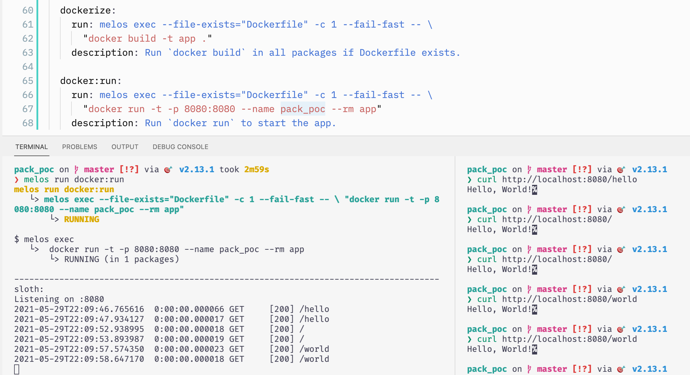

# Pack PoC

This PoC is to explore https://pub.dev/packages/functions_framework with Docker and prepare for https://buildpacks.io/ to support dart image in near future.

### with initiall commit

## Credits

[**subfuzion/functions-framework-dart**]

https://github.com/subfuzion/functions-framework-dart

The "hello world" function in sloth is copied from this repo so you may read the [README](./packages/sloth/README.md) as well to start. 

[**melos**]

https://pub.dev/packages/melos

